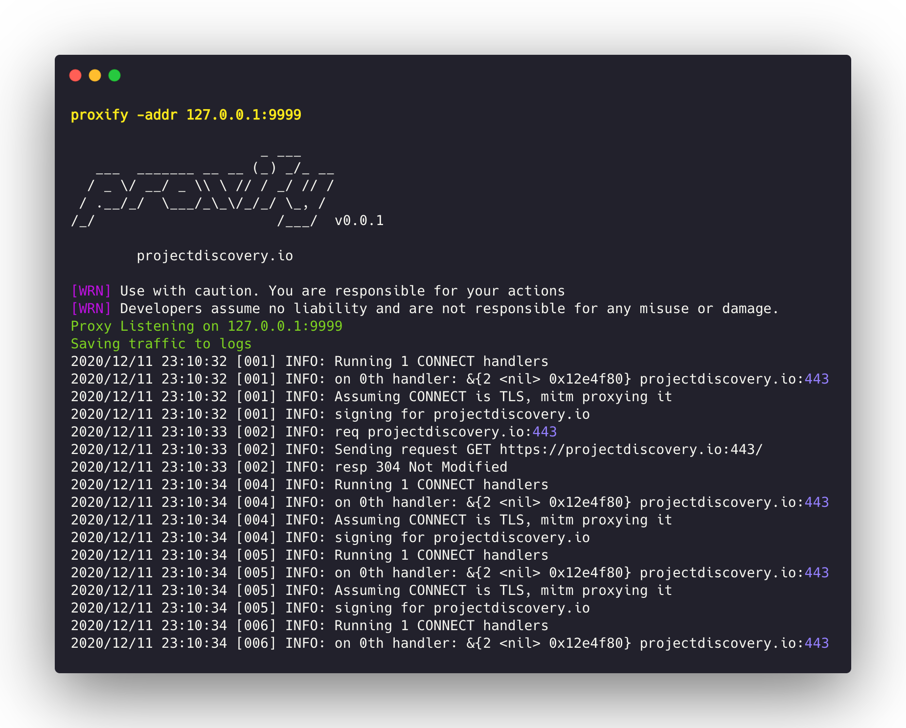

<h1 align="center">
  
</h1>

<p align="center">
<a href="https://opensource.org/licenses/MIT"></a>
<a href="https://github.com/projectdiscovery/proxify/issues"></a>
<a href="https://goreportcard.com/badge/github.com/projectdiscovery/proxify"></a>
<a href="https://github.com/projectdiscovery/proxify/releases"></a>
<a href="https://hub.docker.com/r/projectdiscovery/proxify"></a>
<a href="https://twitter.com/pdiscoveryio"></a>
<a href="https://discord.gg/projectdiscovery"></a>
</p>

<p align="center">
  <a href="#features">Features</a> •
  <a href="#installation">Installation</a> •
  <a href="#usage">Usage</a> •
  <a href="#running-proxify">Running Proxify</a> •
  <a href="#installing-ssl-certificate">Installing SSL Certificate</a> •
  <a href="#applications-of-proxify">Applications of Proxify</a> •
  <a href="https://discord.gg/projectdiscovery">Join Discord</a>
</p>

Swiss Army Knife Proxy for rapid deployments. Supports multiple operations such as request/response dump, filtering and manipulation via DSL language, upstream HTTP/Socks5 proxy.
Additionally, a replay utility allows to import the dumped traffic (request/responses with correct domain name) into BurpSuite or any other proxy by simply setting the upstream proxy to proxify.

# Features

<h1 align="left">
  
  <br>
</h1>


 - Intercept / Manipulate **HTTP/HTTPS** & **NON-HTTP** traffic
 - **Invisible & Thick clients** traffic proxy support
 - TLS MITM support with client/server certificates
 - **HTTP** and **SOCKS5** support for upstream proxy
 - Traffic **Match/Filter and Replace** DSL support
 - Full traffic dump to file (request/responses)
 - Native embedded DNS server
 - Plugin Support to decode specific protocols (e.g XMPP/SMTP/FTP/SSH/)
 - Proxify Traffic replay in Burp

# Installation

Download the ready to run [binary](https://github.com/projectdiscovery/proxify/releases/) or install/build using GO

```shell
go install -v github.com/projectdiscovery/proxify/cmd/proxify@latest
```

# Usage

```shell
proxify -h
```

This will display help for the tool. Here are all the switches it supports.

```console
Swiss Army Knife Proxy for rapid deployments. Supports multiple operations such as request/response dump,filtering and manipulation via DSL language, upstream HTTP/Socks5 proxy

Usage:
  ./proxify [flags]

Flags:
OUTPUT:
   -sr, -store-response        store raw http request / response to output directory (default proxify_logs)
   -o, -output                 output file to store proxify logs (default proxify_logs.jsonl)
   -of, -output-format string  output format (jsonl/yaml) (default "jsonl")
   -dump-req                   Dump only HTTP requests to output file
   -dump-resp                  Dump only HTTP responses to output file
   -oca, -out-ca string        Generate and Save CA File to filename

UPDATE:
   -up, -update                 update proxify to latest version
   -duc, -disable-update-check  disable automatic proxify update check

FILTER:
   -req-fd, -request-dsl string[]                   Request Filter DSL
   -resp-fd, -response-dsl string[]                 Response Filter DSL
   -req-mrd, -request-match-replace-dsl string[]    Request Match-Replace DSL
   -resp-mrd, -response-match-replace-dsl string[]  Response Match-Replace DSL

NETWORK:
   -ha, -http-addr string    Listening HTTP IP and Port address (ip:port) (default "127.0.0.1:8888")
   -sa, -socks-addr          Listening SOCKS IP and Port address (ip:port) (default 127.0.0.1:10080)
   -da, -dns-addr string     Listening DNS IP and Port address (ip:port)
   -dm, -dns-mapping string  Domain to IP DNS mapping (eg domain:ip,domain:ip,..)
   -r, -resolver string      Custom DNS resolvers to use (ip:port)

PROXY:
   -hp, -http-proxy string[]    Upstream HTTP Proxies (eg http://proxy-ip:proxy-port)
   -sp, -socks5-proxy string[]  Upstream SOCKS5 Proxies (eg socks5://proxy-ip:proxy-port)
   -c int                       Number of requests before switching to the next upstream proxy (default 1)

EXPORT:
   -max-size int  Max export data size (request/responses will be truncated) (default 9223372036854775807)

CONFIGURATION:
   -config string              path to the proxify configuration file
   -ec, -export-config string  proxify export module configuration file (default "$CONFIG/export-config.yaml")
   -config-directory string    override the default config path (default "$CONFIG/proxify")
   -cert-cache-size int        Number of certificates to cache (default 256)
   -a, -allow string[]         Allowed list of IP/CIDR's to be proxied
   -d, -deny string[]          Denied list of IP/CIDR's to be proxied
   -pt, -passthrough string[]  List of passthrough domains

DEBUG:
   -nc, -no-color      No Color
   -version            Version
   -silent             Silent
   -v, -verbose        Verbose
   -vv, -very-verbose  Very Verbose

```

### Running Proxify

Runs an HTTP proxy on port **8888**:
```shell
proxify
```

Runs an HTTP proxy on custom port **1111**:
```shell
proxify -http-addr ":1111"
```

### TLS pass through

The -pt flag can be used pass through (skip) encrypted traffic without attempting to terminate the TLS connection.


```bash
proxify -pt '(.*\.)?google\.co.in.*'
```

### Proxify with upstream proxy


Runs an HTTP proxy on port 8888 and forward the traffic to burp on port **8080**:
```shell
proxify -http-proxy http://127.0.0.1:8080
```

Runs an HTTP proxy on port 8888 and forward the traffic to the TOR network:
```shell
proxify -socks5-proxy 127.0.0.1:9050
```


### Dump all the HTTP/HTTPS traffic

Proxify supports three output formats: **JSONL**, **YAML** and **Files**.

**JSONL** (default):

In Json Lines format each Http Request/Response pair is stored as json object in a single line. 

```json
{"timestamp":"2024-02-20T01:56:49+05:30","url":"https://scanme.sh:443","request":{"header":{"Connection":"close","User-Agent":"curl/8.1.2","host":"scanme.sh:443","method":"CONNECT","path":"","scheme":"https"},"raw":"CONNECT scanme.sh:443 HTTP/1.1\r\nHost: scanme.sh:443\r\nConnection: close\r\nUser-Agent: curl/8.1.2\r\n\r\n"},"response":{"header":{"Content-Length":"0"},"raw":"HTTP/1.1 200 OK\r\nContent-Length: 0\r\n\r\n"}}
{"timestamp":"2024-02-20T01:56:49+05:30","url":"https://scanme.sh/","request":{"header":{"Accept":"*/*","Connection":"close","User-Agent":"curl/8.1.2","host":"scanme.sh","method":"GET","path":"/","scheme":"https"},"raw":"GET / HTTP/1.1\r\nHost: scanme.sh\r\nAccept: */*\r\nConnection: close\r\nUser-Agent: curl/8.1.2\r\n\r\n"},"response":{"header":{"Content-Type":"text/plain; charset=utf-8","Date":"Mon, 19 Feb 2024 20:26:49 GMT"},"body":"ok","raw":"HTTP/1.1 200 OK\r\nConnection: close\r\nContent-Type: text/plain; charset=utf-8\r\nDate: Mon, 19 Feb 2024 20:26:49 GMT\r\n\r\n"}}
```

**Yaml MultiDoc**:

In the YAML MultiDoc format, each HTTP request and response pair is encapsulated as a separate document.All Documents in output yaml file are seperated  by `---` to allow stream parsing and consumption.

```console
proxify -output-format yaml
```

```yaml
timestamp: "2024-02-20T01:40:40+05:30"
url: https://scanme.sh:443
request:
    header:
        Connection: close
        User-Agent: curl/8.1.2
        host: scanme.sh:443
        method: CONNECT
        path: ""
        scheme: https
    body: ""
    raw: "CONNECT scanme.sh:443 HTTP/1.1\r\nHost: scanme.sh:443\r\nConnection: close\r\nUser-Agent: curl/8.1.2\r\n\r\n"
response:
    header:
        Content-Length: "0"
    body: ""
    raw: "HTTP/1.1 200 OK\r\nContent-Length: 0\r\n\r\n"
---
timestamp: "2024-02-20T01:40:40+05:30"
...
```

**Files**:

In Files format, each HTTP request and response pair is stored in separate files with the request followed by the response. Filenames are in format of `{{Host}}-{{randstr}}.txt`. Additionally, **dump-req** or **dump-resp** flag can be used for saving specific part of the request to the file.

```console
proxify -store-response
```

>Note: When using `-store-response` both jsonl and files are generated.

### Hostname mapping with Local DNS resolver

Proxify supports embedding DNS resolver to map hostnames to specific addresses and define an upstream dns server for any other domain name

Runs an HTTP proxy on port `8888` using an embedded dns server listening on port `53` and resolving `www.google.it` to `192.168.1.1` and all other `fqdn` are forwarded upstream to `1.1.1.1`:

```shell
proxify -dns-addr ":53" -dns-mapping "www.google.it:192.168.1.1" -dns-resolver "1.1.1.1:53"
```

This feature is used for example by the `replay` utility to hijack the connections and simulate responses. It may be useful during internal assessments with private dns servers. Using `*` as domain name matches all dns requests.

### Match/Filter traffic with DSL

If the request or response match the filters the dump is tagged with `.match.txt` suffix:

```shell
proxify -request-dsl "contains(request,'firefox')" -response-dsl "contains(response, md5('test'))"
```

### Match and Replace on the fly

Proxify supports modifying Request and Responses on the fly with DSL language.

Here is an example to replace `firefox` word from request to `chrome`:

```shell
proxify -request-match-replace-dsl "replace(request,'firefox','chrome')"
```

Another example using **regex** based replacement of response:


```shell
proxify -response-match-replace-dsl "replace_regex(response, '^authentication failed$', 'authentication ok')"
```

### Replay all traffic into burp

Replay all the dumped requests/responses into the destination URL (http://127.0.0.1:8080) if not specified. For this to work it's necessary to configure burp to use proxify as upstream proxy, as it will take care to hijack the dns resolutions and simulate the remote server with the dumped request. This allows to have in the burp history exactly all requests/responses as if they were originally sent through it, allowing for example to perform a remote interception on cloud, and merge all results locally within burp.

```shell
replay -output "logs/"
```

### Installing SSL Certificate

A certificate authority is generated for proxify which is stored in the folder `~/.config/proxify/` as default, manually can be specified by `-config` flag. The generated certificate can be imported by visiting [http://proxify/cacert](http://proxify/cacert) in a browser connected to proxify. 

Installation steps for the Root Certificate is similar to other proxy tools which includes adding the cert to system trusted root store.

### Applications of Proxify

Proxify can be used for multiple places, here are some common example where Proxify comes handy:

<details>
<summary>👉 Storing all the burp proxy history logs locally. </summary>

Runs an HTTP proxy on port `8888` and forward the traffic to burp on port `8080`:

```shell
proxify -http-proxy http://127.0.0.1:8080
```

From BurpSuite, set the Upstream Proxy to forward all the traffic back to `proxify`:

```
User Options > Upstream Proxy > Proxy & Port > 127.0.0.1 & 8888
```
Now all the request/response history will be stored in `logs` folder that can be used later for post-processing.

</details>


<details>
<summary>👉 Store all your browse history locally. </summary>


While you browse the application, you can point the browser to `proxify` to store all the HTTP request / response to file.

Start proxify on default or any port you wish,

```shell
proxify -output chrome-logs
```

Start Chrome browser in macOS,
```shell
/Applications/Chromium.app/Contents/MacOS/Chromium --ignore-certificate-errors --proxy-server=http://127.0.0.1:8888 &
```

</details>

<details>
<summary>👉 Store all the response of while you fuzz as per you config at run time. </summary>


Start proxify on default or any port you wish:

```shell
proxify -output ffuf-logs
```

Run `FFuF` with proxy pointing to `proxify`:

```shell
ffuf -x http://127.0.0.1:8888 FFUF_CMD_HERE
```

</details>

------

`Proxify` is made with 🖤 by the [projectdiscovery](https://projectdiscovery.io) team. Community contributions have made the project what it is. See the **[Thanks.md](https://github.com/projectdiscovery/proxify/blob/master/THANKS.md)** file for more details.
